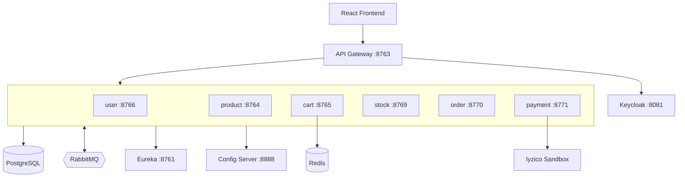

# 👩‍💻 KubaShop — n11 TalentHub Bootcamp Final Projesi

KubaShop, **Spring Boot mikroservis mimarisi** ve **React.js (Vite)** ile geliştirilmiş fullstack bir e-ticaret uygulamasıdır. Ürün kataloğu, sepet yönetimi, stok kontrolü, sipariş akışı, **Iyzico Sandbox** ödemesi, **Keycloak/JWT** güvenliği, **RabbitMQ** üzerinden Saga pattern, **Redis** sepet cache'i, **Eureka** servis keşfi ve **Spring Cloud Gateway** içerir. n11 TalentHub Bootcamp bitirme projesi olarak hazırlanmış ve canlı sunucuya deploy edilmiştir.

---

## Canlı Erişim

| Servis | URL | Kullanıcı | Şifre |
|---|---|---|---|
| Frontend (KubaShop) | http://92.249.61.16 | Üyelik formundan oluşturulur | — |
| Swagger UI | http://92.249.61.16:8763/swagger-ui/index.html | — | — |
| Eureka Discovery | http://92.249.61.16:8761 | — | — |
| Keycloak Admin | http://92.249.61.16:8081 | `admin` | `admin` |
| RabbitMQ Management | http://92.249.61.16:15674 | `guest` | `guest` |

---

## Proje Özeti

Kullanıcı, frontend'in yan kısmından üyelik oluşturur ve giriş yapar — bu süreç **Keycloak + JWT** ile yönetilir. Giriş yapmadan da ürün listesi ve ürün detay sayfaları görüntülenebilir, ancak alışveriş yapılamaz.

Sepete birden fazla ürün eklenebilir; **+ ve − butonları** ile adetler artırılıp azaltılabilir, toplam fiyat anlık olarak yansır. Ürün detay sayfasından da sepete ekleme yapılabilir. Bir ürün eklendiğinde `shopping-card-service` Redis üzerinde sepeti günceller ve aynı zamanda `shopping_cart_queue`'ya bir audit mesajı publish eder (RabbitMQ kullanımının canlı kanıtı; `CartAuditConsumer` mesajları tüketip log'a yazar).

Kullanıcı ilk defa **10.000 TL üzeri** alışveriş tamamladığında bir sonraki siparişinde kullanılmak üzere tek kullanımlık **%20 indirim kuponu** kazanır. Tekrar alışveriş yaptığında bu kupon "Aktif Kuponlarım" bölümünde görünür, **"Kodu Kullan"** ile uygulanır ve ödemesi **Iyzico Sandbox** üzerinden gerçekleştirilir.

Ödeme akışında `payment-service` Iyzico Sandbox ile ödemeyi alır, başarılı ödeme sonrası `order-service`'e sipariş oluşturma isteği iletilir. `order-service` siparişi kaydeder ve **Saga pattern** ile RabbitMQ üzerinden `stock-service`'ten stok rezervasyonu ister. Stok rezerve edilirse sipariş `COMPLETED`, edilmezse `CANCELLED` olur. Başarılı siparişten sonra sepet otomatik temizlenir.

---

## Özellikler

- **RESTful API:** ürün listeleme, sepet ve sipariş işlemlerini yöneten servisler
- **Veritabanı:** her servisin kendi şeması, PostgreSQL üzerinden yönetim
- **Pagination:** ürün listesinde sayfalama (Spring `Pageable`)
- **Cache:** Redis ile sepet işlemleri (kullanıcı bazlı anahtar)
- **Asenkron mesajlaşma:** RabbitMQ ile saga (sipariş ↔ stok) ve audit log akışı
- **Service Discovery:** Eureka ile dinamik servis keşfi
- **API Gateway:** Spring Cloud Gateway (WebFlux) tek giriş kapısı, JWT doğrulama, route'lama
- **Güvenlik:** Keycloak `microservice-realm` + Spring Security OAuth2 Resource Server
- **Ödeme:** Iyzico Java SDK Sandbox entegrasyonu
- **Bildirim/Pop-up:** Frontend'de **SweetAlert2** ile başarı / hata / uyarı modal ve toast'ları
- **Test:** Unit ve integration testler her servis için (`*ServiceTest`, `*ControllerTest`, `*RepositoryTest`, `*IntegrationTest`)
- **Dokümantasyon:** Swagger / OpenAPI (Springdoc) + Gateway aggregation
- **Loglama:** SLF4J + Logback ile her servis için yapılandırılmış log
- **DevOps:** Docker Compose ile çoklu container orkestrasyonu, **Jib / Spring Boot Buildpack** ile Dockerfile'sız image üretimi
- **Deployment:** Ubuntu 22.04 VPS üzerinde production deploy, RabbitMQ Management UI ile canlı saga izleme
- **Frontend:** React.js + Vite + Axios + React Router + SweetAlert2, Codex desteği ile geliştirildi
- **Test:** Tüm endpoint'ler [Swagger UI](http://92.249.61.16:8763/swagger-ui/index.html) üzerinden veya Postman/curl ile denenebilir
- **Iyzico test kartları:** Ödeme test senaryoları için → https://docs.iyzico.com/ek-bilgiler/test-kartlari

---

## Proje Resimleri

> Ekran görüntülerini `docs/screenshots/` klasörüne ekleyebilirsin.

- Ürün listeleme
- Ürün detay
- Sepet sayfası
- Ödeme formu

---

## Mimari



---

## Mikroservisler

`api-gateway` · `discovery-server` · `config-server` · `user-service` · `product-service` · `shopping-card-service` · `stock-service` · `order-service` · `payment-service`

### `api-gateway` (port `8763`)
Tek giriş kapısı. Spring Cloud Gateway (WebFlux) ve Spring Security OAuth2 Resource Server kullanılır; Keycloak JWT'sini doğrular, route'lama yapar, CORS'u tek noktadan yönetir, Swagger UI'ı tüm servislerden aggregate eder.
**Pattern:** API Gateway, JWT Validation

### `discovery-server` (port `8761`)
Spring Cloud Netflix Eureka Server. Tüm mikroservislerin kendilerini kaydettiği ve `lb://SERVICE-NAME` ile bulunduğu canlı keşif sunucusu.
**Pattern:** Service Discovery

### `config-server` (port `8888`)
Spring Cloud Config Server. Tüm servislerin `application.properties` ayarlarını merkezi olarak yönetir.

### `user-service` (port `8766`)
Spring Web + JPA + PostgreSQL + Keycloak Admin Client. Üyelik (signup) ve giriş (signin) akışını yönetir, Keycloak'ta kullanıcı oluşturur, lokal DB'de profil tutar, JWT token döner.
**Pattern:** Adapter (Keycloak ↔ Application)

### `product-service` (port `8764`)
Spring Web + JPA + PostgreSQL. Ürün listeleme ve ürün detay listeleme (read-only public). Pagination ile sayfalama yapar.
**Pattern:** Repository, Pagination

### `shopping-card-service` (port `8765`)
Spring Web + Spring Data Redis + RabbitMQ. Sepeti Redis'te username anahtarı ile tutar; ekleme/güncelleme/silme/temizleme işlemlerini yapar. Her ekleme `shopping_cart_queue`'ya audit mesajı publish eder; `CartAuditConsumer` bu mesajları tüketip log'a yazar.
**Pattern:** Cache-Aside (Redis), Event Publishing

### `stock-service` (port `8769`)
Spring Web + JPA + PostgreSQL + RabbitMQ. Ürün stoklarını yönetir, Saga akışında rezerve / commit / release / reject işlemlerini yapar.

### `order-service` (port `8770`)
Spring Web + JPA + PostgreSQL + RabbitMQ + OpenFeign. Sipariş oluşturma (Saga başlatıcısı), kupon üretimi, sipariş statü makinesi (`CREATED → STOCK_RESERVED → COMPLETED` veya `CANCELLED`) ve sipariş geçmişi yönetimi.
**Pattern:** Saga (Choreography), State Machine
**Kupon kuralı:** Daha önce 10.000 TL üzeri alışveriş yapan müşteriler bir sonraki alışverişlerinde tek kullanımlık %20 kupon kazanır.

### `payment-service` (port `8771`)
Spring Web + Iyzico Java SDK + OpenFeign. Ödeme isteğini Iyzico Sandbox'a iletir, başarılı ödeme sonrası order-service'e siparişi tetikler, başarısız ödemede frontend'e detaylı hata gönderir.
**Geliştirme:** Iyzico SDK entegrasyonu Codex ile beraber yazıldı.

---

## Güvenlik Modeli

Keycloak `microservice-realm` üzerinden JWT tabanlı kimlik doğrulama yapılır. Public endpoint'ler signup/signin, ürün listesi (GET), kupon listesi (GET) ve Swagger; sipariş oluşturma (POST `/api/orders`) ve ödeme (`/api/payments`) endpoint'leri JWT zorunludur. Frontend, `localStorage.kuba_token` üzerinden Axios interceptor ile her isteğe `Authorization: Bearer ...` ekler.

---

## Kullanılan Teknolojiler

**Backend:** Java 21, Spring Boot 3.5, Spring Web / Data JPA / Security / OAuth2, Spring Cloud Gateway / Config / Eureka / OpenFeign, Spring AMQP, Redis (Lettuce), PostgreSQL 15, Keycloak 25, Iyzico Java SDK, Springdoc OpenAPI 2.8, JUnit 5 + Mockito, Maven + Spring Boot Buildpack, Docker Compose.

**Frontend:** React 19, Vite 8, React Router, Axios (interceptor + skipAuth flag), SweetAlert2 (popup/toast), Jest + React Testing Library.

**DevOps:** Docker Compose ile 12 container orkestrasyonu, **Jib** ile Dockerfile'sız image üretimi, Ubuntu 22.04 VPS production deploy.

---

## Notlar

Frontend, payment-service ve Docker + Jib kısımları için **OpenAI Codex** ve **Anthropic Claude** desteği alındı; tüm entegrasyonlar tarafımdan kontrol edilerek adım adım geliştirildi.

---

## Lokal Çalıştırma

```bash
# 1. Repo'yu klonla
git clone https://github.com/<your-username>/n11-talenthub-bootcamp-final-project.git
cd n11-talenthub-bootcamp-final-project

# 2. Tüm backend image'larını üret (Spring Boot Buildpack — Dockerfile gerektirmez)
cd n11-talenthub-project-be
for svc in discovery-server config-server api-gateway user-service product-service \
           shopping-card-service stock-service order-service payment-service; do
  ( cd $svc && mvn clean package -DskipTests \
    && mvn spring-boot:build-image -DskipTests \
       -Dspring-boot.build-image.imageName=$svc:latest )
done
cd ..

# 3. Tüm stack'i ayağa kaldır (postgres, rabbit, redis, keycloak + 9 mikroservis)
docker compose up -d
docker compose ps

# 4. Frontend (lokal dev)
cd ecommerce-frontend
npm install
npm run dev   # http://localhost:5173
```

> Backend tamamen ayağa kalkması ~60 saniye sürer (Eureka kayıt + Keycloak hazırlığı). Sağlık kontrolü için `docker compose ps` ile tüm servislerin **Up (healthy)** olduğunu doğrula.

---

👩‍💻 **Geliştirici:** Kübra Karadirek
