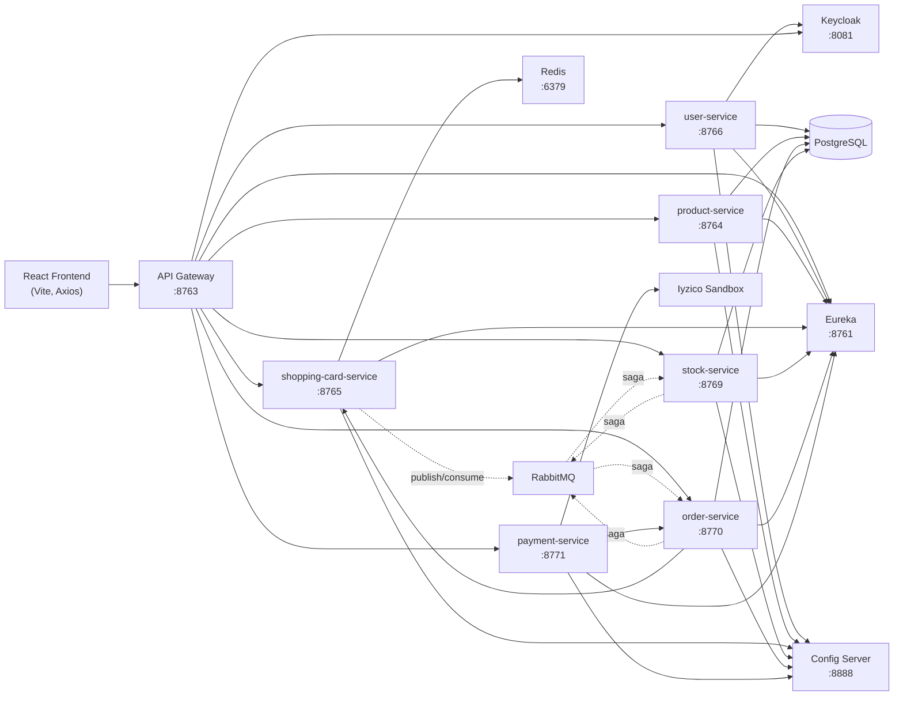

# 👩‍💻 KubaShop — n11 TalentHub Bootcamp Final Projesi

KubaShop, **Spring Boot mikroservis mimarisi** ve **React.js (Vite)** ile geliştirilmiş fullstack bir e-ticaret uygulamasıdır. Ürün kataloğu, sepet yönetimi, stok kontrolü, sipariş akışı, **Iyzico Sandbox** ödeme entegrasyonu, **Keycloak/JWT** tabanlı güvenlik, **RabbitMQ** üzerinden Saga pattern, **Redis** sepet cache'i, **Eureka** servis keşfi, **Spring Cloud Gateway** ve **Spring Cloud Config Server** içerir.

n11 TalentHub Bootcamp bitirme projesi kapsamında hazırlanmış ve canlı sunucuya deploy edilmiştir.

---

## Canlı Erişim

| Servis | URL |
|---|---|
| Frontend (KubaShop) | http://92.249.61.16 |
| Swagger UI (Aggregated) | http://92.249.61.16:8763/swagger-ui/index.html |
| Eureka Discovery | http://92.249.61.16:8761 |
| Keycloak | http://92.249.61.16:8081 |
| RabbitMQ Management | http://92.249.61.16:15674 |

---

## Proje Özeti

Kullanıcı, frontend'in yan kısmından **üyelik oluşturur ve giriş yapar**, ardından ürün listesi ve ürün detay sayfalarını görüntüler. Bir ürünü sepete eklediğinde `shopping-card-service` Redis üzerinde sepetini günceller ve aynı zamanda `shopping_cart_queue`'ya bir audit mesajı publish eder (RabbitMQ kullanımının canlı kanıtı; `CartAuditConsumer` mesajları tüketip log'a yazar).

Sepet onayında ödeme formu doldurulur, **`payment-service`** Iyzico Sandbox ile ödemeyi gerçekleştirir, başarılı ödeme sonrası **`order-service`**'e sipariş oluşturma isteği iletilir. `order-service` siparişi kaydeder ve **Saga pattern** ile RabbitMQ üzerinden `stock-service`'ten stok rezervasyonu ister. Stok rezerve edilirse sipariş `COMPLETED`, edilmezse `CANCELLED` olur. Başarılı siparişten sonra sepet otomatik temizlenir; **daha önce 10.000 TL üzeri alışveriş yapan müşteri bir sonraki siparişinde tek kullanımlık %20 indirim kuponu** kazanır.

---

## Ekran Görüntüleri

> Görselleri `docs/screenshots/` klasörüne ekleyip linkleri güncelleyebilirsin.

- Ürün listeleme
- Ürün detay
- Sepet sayfası
- Ödeme formu

---

## Mimari



---

## Servisler ve Sorumlulukları

### `api-gateway` (port `8763`)
- **Stack:** Spring Cloud Gateway (WebFlux), Spring Security OAuth2 Resource Server (Keycloak JWT)
- **Sorumluluk:** Tek giriş kapısı, JWT doğrulama, route'lama, CORS yönetimi (tek noktadan), Swagger aggregation

### `discovery-server` (port `8761`)
- **Stack:** Spring Cloud Netflix Eureka Server
- **Sorumluluk:** Tüm mikroservislerin canlı keşfi, `lb://SERVICE-NAME` çözümü
- **Pattern:** Service Discovery

### `config-server` (port `8888`)
- **Stack:** Spring Cloud Config Server
- **Sorumluluk:** Tüm servislerin `application.properties`'ini merkezden yönetmek

### `user-service` (port `8766`)
- **Stack:** Spring Web, Spring Data JPA, PostgreSQL, Keycloak Admin Client
- **Sorumluluk:** Signup ve signin akışını yönetir, Keycloak'ta kullanıcı oluşturur, lokal DB'de profil tutar, JWT token döner

### `product-service` (port `8764`)
- **Stack:** Spring Web, Spring Data JPA, PostgreSQL, Pagination
- **Sorumluluk:** Ürün listeleme ve ürün detay listeleme (read-only)

### `shopping-card-service` (port `8765`)
- **Stack:** Spring Web, Spring Data Redis, RabbitMQ
- **Sorumluluk:** Kullanıcının sepetini Redis'te tutar (anahtar = username), sepet işlemleri (ekle/güncelle/sil/temizle), her ekleme `shopping_cart_queue`'ya audit mesajı publish eder
- **Pattern:** Cache-Aside (Redis), Event Publishing
- **Queue tüketimi:** `CartAuditConsumer` → `shopping_cart_queue` → loglama

### `stock-service` (port `8769`)
- **Stack:** Spring Web, Spring Data JPA, PostgreSQL, RabbitMQ
- **Sorumluluk:** Ürün stoklarını yönetir, Saga'da rezerve/commit/release işlemlerini yapar, gerekirse rejection event yayınlar

### `order-service` (port `8770`)
- **Stack:** Spring Web, Spring Data JPA, PostgreSQL, RabbitMQ, OpenFeign (stock-service ve shopping-card-service'e sync çağrılar için)
- **Sorumluluk:** Sipariş oluşturma (Saga başlatıcısı), kupon üretimi, sipariş statü makinesi (`CREATED → STOCK_RESERVED → COMPLETED` veya `CANCELLED`), sipariş geçmişi
- **Kupon kuralı (nice-to-have):** Daha önce 10.000 TL üzeri alışveriş yapan müşteriler bir sonraki alışverişlerinde tek kullanımlık %20 kupon kazanır

### `payment-service` (port `8771`)
- **Stack:** Spring Web, Iyzico Java SDK, OpenFeign (order-service'e), Spring Validation
- **Sorumluluk:** Ödeme isteğini Iyzico Sandbox'a iletir, başarılı ödeme sonrası order-service'e siparişi oluşturmaya tetikler, başarısız ödemede frontend'e detaylı hata gönderir
- **Geliştirme:** Iyzico SDK entegrasyonu doğrudan **Codex** ile yazıldı

---

## Güvenlik Modeli

- **Keycloak realm:** `microservice-realm`
- **Public endpoint'ler:** `/api/user/signup`, `/api/user/signin`, `/api/products/**` (GET), `/api/stock/**` (GET), `/api/orders/coupons/**` (GET), `/api/shopping-cart/**`, Swagger
- **Korumalı endpoint'ler (JWT zorunlu):** `/api/orders/**` (POST), `/api/payments/**`
- **Frontend:** `localStorage.kuba_token` üzerinden Axios interceptor ile her isteğe `Authorization: Bearer ...` ekler

---

## Kullanılan Teknolojiler

### Backend
- Java **21**, Spring Boot **3.5.x**
- Spring Web, Data JPA, Validation, Security, OAuth2 Resource Server
- Spring Cloud: Gateway (WebFlux), Config Server, Netflix Eureka, OpenFeign
- Spring AMQP / RabbitMQ
- Redis (Spring Data Redis, Lettuce)
- PostgreSQL 15, Keycloak 25
- Iyzico Java SDK (Sandbox)
- Springdoc OpenAPI 2.8.16
- JUnit 5, Mockito, Spring Boot Test
- Maven, Spring Boot Buildpack
- Docker, Docker Compose

### Frontend
- React **19**, Vite 8
- React Router, Axios (interceptor + skipAuth flag)
- React Hooks: `useState`, `useEffect`
- SweetAlert2
- Jest + React Testing Library

### DevOps
- **Docker Compose** ile tek komutla 12 container ayağa kalkar
- **Spring Boot Buildpack / Jib** ile Dockerfile yazmadan image üretimi
- VPS (Ubuntu 22.04) üzerinde production deployment
- RabbitMQ Management UI ile canlı saga izleme

---

## Bootcamp Gereksinim Karşılama

Backend tarafında RESTful web servisleri tüm mikroservisler için RestController + DTO yapısıyla yazıldı. PostgreSQL üzerinde user, product, order ve stock servisleri için ayrı şemalar kullanıldı, **pagination eklendi** (product-service `Pageable` ile). Sepet işlemleri shopping-card-service üzerinden Redis'le yönetildi, sipariş yönetimi order-service + Saga state machine ile, ödeme entegrasyonu payment-service Iyzico Sandbox ile sağlandı. JWT auth Keycloak + Gateway resource server ile, dokümantasyon Springdoc + Gateway aggregation ile, loglama SLF4J + Logback ile yapıldı; ayrıca audit consumer log'u RabbitMQ tarafında çalışıyor. Unit ve integration testleri `*ServiceTest`, `*ControllerTest`, `*RepositoryTest`, `*IntegrationTest` sınıflarında yer alıyor.

### Frontend gereksinimleri

| Gereksinim | Karşılayan |
|---|---|
| Ürün listeleme & detay | `ProductList`, `ProductDetail` componentleri |
| Hooks ile state | `useState`, `useEffect`, `useNavigate` |
| Pagination UI | Ürün listesi sayfalama |
| Sepet UI | `CartPage` + `CartItem` |
| API entegrasyonu | `services/apiClient.js` Axios + interceptor |
| Hata yönetimi | SweetAlert2 toast'ları + try/catch + loading state |

### Nice-to-have: Kupon Sistemi

Kullanıcı ilk 10.000 TL üzeri alışveriş yapıp sipariş verirse bir sonraki siparişine **%20 kupon** olur. Tek kullanımlık `KUBA20-XXXXXX` formatında üretilir.

1. `coupons` tablosuna `userId`, `code`, `used=false` ile yazılır
2. Frontend `CartPage`'in "Aktif Kuponlarım" bölümü `/api/orders/coupons/user/{userId}` ile listeyi getirir
3. Kupon kullanıldığında `used=true` set edilir ve indirim ara toplama uygulanır

---

## Frontend Geliştirme Notu

Frontend tarafının ilk iskeleti, component yapısı, CSS tasarımı ve SweetAlert2 entegrasyonları **OpenAI Codex** desteğiyle hazırlandı. Backend ile entegrasyon kısımları (Axios interceptor mantığı, `kuba_token` yönetimi, ödeme formundan payment-service'e giden istek yapısı, kupon listesi çağrıları) tarafımdan elle kontrol edildi ve test edilerek production'a hazır hale getirildi.

---

## Yapay Zeka Yardımı

| Konu | AI Aracı |
|---|---|
| Frontend component iskeletleri ve CSS | OpenAI Codex |
| Payment-service Iyzico SDK entegrasyonu | OpenAI Codex + Anthropic Claude |
| RabbitMQ saga, exchange, queue, binding düzenlemeleri | Anthropic Claude |
| Docker + Jib (Dockerfile'sız image) yaklaşımı | OpenAI Codex |

Gözden geçirilerek geliştirildi.

---

## Lokal Çalıştırma

```bash
# 1. Repo'yu klonla
git clone https://github.com/<your-username>/n11-talenthub-bootcamp-final-project.git
cd n11-talenthub-bootcamp-final-project

# 2. Backend image'larını üret
cd n11-talenthub-project-be
for svc in discovery-server config-server api-gateway user-service product-service shopping-card-service stock-service order-service payment-service; do
  cd $svc
  mvn clean package -DskipTests
  mvn spring-boot:build-image -DskipTests -Dspring-boot.build-image.imageName=$svc:latest
  cd ..
done
cd ..

# 3. Stack'i ayağa kaldır
docker compose up -d

# 4. Frontend
cd ecommerce-frontend
npm install
npm run dev
```

---

## Referans

[selimsahindev/n11-talenthub-bootcamp-final-case](https://github.com/selimsahindev/n11-talenthub-bootcamp-final-case)

---

👩‍💻 **Geliştirici:** Kübra Karadirek
