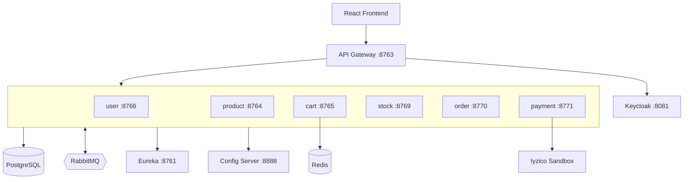

# KubaShop - n11 TalentHub Bootcamp Final Project

KubaShop is a full-stack e-commerce application built with Spring Boot microservices and a React + Vite frontend. It includes product listing, cart management, stock reservation, order creation, Iyzico Sandbox payment, Keycloak/JWT authentication, Redis cart storage, RabbitMQ-based messaging, Eureka discovery, Spring Cloud Config, and Spring Cloud Gateway.

The project was previously deployed on a VPS, but the current setup is documented for local development with Docker Compose.

---

## Local Access

| Service | URL | Username | Password |
|---|---|---|---|
| Frontend (KubaShop) | http://localhost:5173 | Created through the registration form | - |
| API Gateway | http://localhost:8763 | - | - |
| Swagger UI | http://localhost:8763/swagger-ui.html | - | - |
| Eureka Discovery | http://localhost:8761 | - | - |
| Keycloak Admin | http://localhost:8081 | `admin` | `admin` |
| RabbitMQ Management | http://localhost:15674 | `guest` | `guest` |

Useful service ports:

| Service | Port |
|---|---:|
| Config Server | `8888` |
| Product Service | `8764` |
| Shopping Cart Service | `8765` |
| User Service | `8766` |
| Stock Service | `8769` |
| Order Service | `8770` |
| Payment Service | `8771` |
| PostgreSQL host port | `5434` |
| RabbitMQ AMQP host port | `5674` |
| Redis | `6379` |

---

## Project Overview

Users can register and sign in through the frontend. Authentication is handled by Keycloak and JWT. Product list and product detail pages are public, while cart, order, payment, and coupon operations use authenticated requests where needed.

Products can be added to the cart, quantities can be updated, and totals are recalculated in real time. The shopping cart is stored in Redis. Cart changes also publish audit messages to RabbitMQ.

During checkout, payment-service processes payment through Iyzico Sandbox. After a successful payment, order-service creates the order and starts the stock reservation flow through RabbitMQ. Stock-service reserves stock and publishes the result back. Orders become `COMPLETED` when stock is reserved successfully, or `CANCELLED` when stock reservation fails.

Users who complete an order over 10,000 TL can earn a one-time 20% coupon for the next order.

---

## Features

- REST APIs for product, cart, stock, order, coupon, payment, and user flows
- PostgreSQL databases per domain
- Redis-backed cart storage
- RabbitMQ for Saga stock reservation and cart audit messages
- Eureka service discovery
- Spring Cloud Config for centralized service configuration
- Spring Cloud Gateway as the single backend entry point
- Keycloak realm import for local authentication setup
- Iyzico Sandbox payment integration
- Swagger/OpenAPI documentation
- React + Vite frontend with Axios and SweetAlert2
- Docker Compose local orchestration

---

## Project Pictures


- Product listing
- Product detail
- Cart page
- Payment form

---

## Architecture



---

## Microservices

`api-gateway` · `discovery-server` · `config-server` · `user-service` · `product-service` · `shopping-card-service` · `stock-service` · `order-service` · `payment-service`

### `api-gateway` (port `8763`)

Single entry point for frontend requests. Handles routing, JWT validation, CORS, and Swagger aggregation.

### `discovery-server` (port `8761`)

Eureka discovery server where backend services register themselves.

### `config-server` (port `8888`)

Centralized configuration server. Local config files are served from `config-server/src/main/resources/config`.

### `user-service` (port `8766`)

Handles signup/signin, stores user records in PostgreSQL, and creates users in Keycloak.

### `product-service` (port `8764`)

Provides public product listing and product detail endpoints with pagination.

### `shopping-card-service` (port `8765`)

Stores carts in Redis and publishes cart audit messages to RabbitMQ.

### `stock-service` (port `8769`)

Manages product stock and consumes stock reservation requests from RabbitMQ.

### `order-service` (port `8770`)

Creates orders, starts the stock reservation Saga, stores coupons, and exposes coupon preview/listing endpoints.

### `payment-service` (port `8771`)

Processes payments through Iyzico Sandbox and calls order-service after successful payment.

---

## Local Setup

### Requirements

- Docker Desktop
- Java 21
- Maven
- Node.js and npm

### Start Backend

If backend images already exist:

```powershell
docker compose up -d
docker compose ps
```

If backend images need to be rebuilt:

```powershell
cd n11-talenthub-project-be

cd discovery-server; mvn clean package -DskipTests; mvn spring-boot:build-image -DskipTests -Dspring-boot.build-image.imageName=discovery-server:latest; cd ..
cd config-server; mvn clean package -DskipTests; mvn spring-boot:build-image -DskipTests -Dspring-boot.build-image.imageName=config-server:latest; cd ..
cd api-gateway; mvn clean package -DskipTests; mvn spring-boot:build-image -DskipTests -Dspring-boot.build-image.imageName=api-gateway:latest; cd ..
cd user-service; mvn clean package -DskipTests; mvn spring-boot:build-image -DskipTests -Dspring-boot.build-image.imageName=user-service:latest; cd ..
cd product-service; mvn clean package -DskipTests; mvn spring-boot:build-image -DskipTests -Dspring-boot.build-image.imageName=product-service:latest; cd ..
cd shopping-card-service; mvn clean package -DskipTests; mvn spring-boot:build-image -DskipTests -Dspring-boot.build-image.imageName=shopping-card-service:latest; cd ..
cd stock-service; mvn clean package -DskipTests; mvn spring-boot:build-image -DskipTests -Dspring-boot.build-image.imageName=stock-service:latest; cd ..
cd order-service; mvn clean package -DskipTests; mvn spring-boot:build-image -DskipTests -Dspring-boot.build-image.imageName=order-service:latest; cd ..
cd payment-service; mvn clean package -DskipTests; mvn spring-boot:build-image -DskipTests -Dspring-boot.build-image.imageName=payment-service:latest; cd ..

cd ..
docker compose up -d
```

### Start Frontend

```powershell
cd ecommerce-frontend
npm install
npm run dev
```

Open:

```text
http://localhost:5173
```

The frontend uses:

```env
VITE_API_BASE_URL=http://localhost:8763
REACT_APP_API_BASE_URL=http://localhost:8763
```

---

## Local Data Notes

PostgreSQL is mapped to host port `5434` because local machines often already use `5432`.

Do not use this command if you want to keep local database data:

```powershell
docker compose down -v
```

The `-v` option deletes Docker volumes, including PostgreSQL data.

If product data needs to be restored, run:

```powershell
Get-Content .\db-seed-products-only.sql -Raw -Encoding UTF8 | docker exec -i n11-postgres-db psql -U postgres -d product_db
```

---

## RabbitMQ Notes

Services inside Docker use:

```properties
spring.rabbitmq.host=rabbitmq
spring.rabbitmq.port=5672
```

From the host machine:

- RabbitMQ AMQP: `localhost:5674`
- RabbitMQ Management UI: `http://localhost:15674`

Important queues:

- `shopping_cart_queue`
- `stock.reserve.requested.queue`
- `order.stock.reserved.queue`
- `order.stock.rejected.queue`
- `stock.reserve.requested.dlq`

---

## Security Model

Keycloak runs locally at:

```text
http://localhost:8081
```

The local realm is:

```text
microservice-realm
```

Keycloak is initialized through:

```text
docker/keycloak/import/microservice-realm.json
```

Frontend login stores the JWT in:

```text
localStorage.kuba_token
```

Axios attaches it to authenticated API calls as:

```text
Authorization: Bearer <token>
```

---

## Iyzico Sandbox

Payment-service uses Iyzico Sandbox credentials from configuration. Test cards can be checked from Iyzico documentation:

https://docs.iyzico.com/ek-bilgiler/test-kartlari

---

## Developer

Kubra Karadirek
