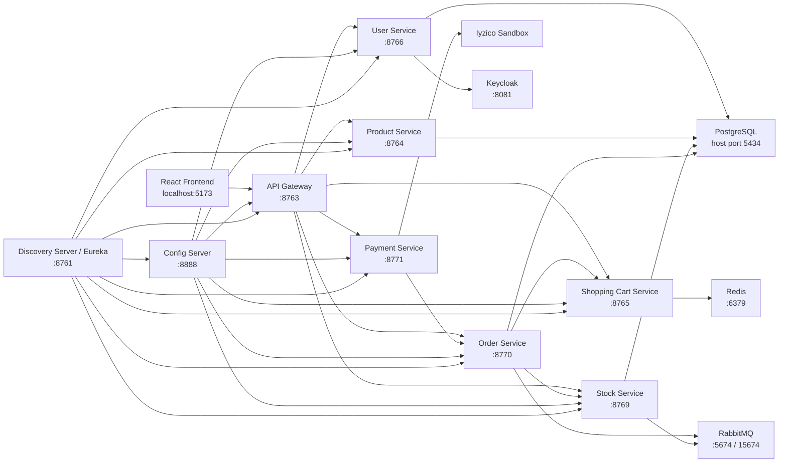

# KubaShop - Fullstack Mikroservis E-Ticaret Projesi

KubaShop, Spring Boot mikroservis mimarisi ve React.js ile geliştirilen fullstack bir e-ticaret uygulamasıdır. Projede ürün listeleme, ürün detay görüntüleme, sepet yönetimi, sipariş oluşturma, stok yönetimi, Iyzico Sandbox ödeme entegrasyonu, JWT tabanlı güvenlik, Swagger dokümantasyonu, testler ve Docker/Jib tabanlı container yapısı yer almaktadır.

Bu proje, n11 TalentHub Bootcamp bitirme projesi kapsamında hazırlanmıştır.

## Proje Özeti

Kullanıcı, frontend üzerinden ürünleri listeler, ürün detayına gider, ürünleri sepete ekler, sepetindeki adetleri günceller ve ödeme formu üzerinden siparişini tamamlar. Ödeme akışı API Gateway üzerinden Payment Service'e gider. Payment Service, Iyzico Sandbox ile ödeme sürecini yürütür ve başarılı ödeme sonrası Order Service'e senkron olarak sipariş oluşturma isteği gönderir. Order Service siparişi kaydeder, stok akışını tetikler ve başarılı siparişten sonra sepet temizleme işlemini başlatır.

Ek özellik olarak, kullanıcının ilk kez 10.000 TL ve üzeri alışverişini tamamlaması durumunda tek kullanımlık %20 indirim kuponu kazanması sağlanmıştır. Kupon sistemi hem backend hem frontend tarafında çalışacak şekilde geliştirilmiştir.

## Kullanılan Teknolojiler

### Backend

- Java 21
- Spring Boot 3.5.x
- Spring Web
- Spring Data JPA
- Spring Validation
- Spring Security
- Spring OAuth2 Resource Server
- Spring Cloud Config Server
- Spring Cloud Gateway
- Spring Cloud Netflix Eureka
- Spring Cloud OpenFeign
- Spring AMQP / RabbitMQ
- Redis
- PostgreSQL
- Keycloak
- Iyzico Java SDK
- Swagger / OpenAPI / Springdoc
- JUnit 5
- Mockito
- Maven
- Jib
- Docker / Docker Compose

### Frontend

- React 19
- Vite
- React Router
- Axios
- React Hooks: `useState`, `useEffect`
- SweetAlert2
- Jest
- React Testing Library
- CSS ile özel lüks tema tasarımı

### DevOps ve Dokümantasyon

- Docker Compose ile servis orkestrasyonu
- Jib ile Dockerfile yazmadan image oluşturma
- Swagger UI ile gateway üzerinden API dokümantasyonu
- GitHub Actions için CI/CD pipeline mantığı
- Jenkins pipeline karşılaştırması
- AWS Elastic Beanstalk + RDS deployment mimarisi bilgisi
- Slack webhook ile deploy bildirimi yaklaşımı

## Mimari



## Proje Dizini

```text
n11-talenthub-bootcamp-final-project
├── docker-compose.yml
├── db-seed-products-stock.sql
├── ecommerce-frontend
│   ├── src
│   │   ├── components
│   │   ├── services
│   │   ├── test
│   │   ├── App.jsx
│   │   └── main.jsx
│   └── package.json
└── n11-talenthub-project-be
    ├── api-gateway
    ├── config-server
    ├── discovery-server
    ├── user-service
    ├── product-service
    ├── shopping-card-service
    ├── stock-service
    ├── order-service
    └── payment-service
```

## Mikroservisler

### Config Server

Merkezi konfigürasyon servisidir. Mikroservislerin port, database, Eureka, RabbitMQ, Redis, Keycloak ve Iyzico gibi ayarları `config-server/src/main/resources/config` altında tutulur.

Kullanılan teknolojiler:

- Spring Cloud Config Server
- Spring Cloud Eureka Client
- Maven
- Jib

Öne çıkan dosyalar:

- `api-gateway.properties`
- `user-service.properties`
- `product-service.properties`
- `shopping-cart-service.properties`
- `stock-service.properties`
- `order-service.properties`
- `payment-service.properties`

### Discovery Server

Eureka Server olarak çalışır. Mikroservisler kendilerini Eureka'ya register eder. API Gateway de servisleri bu kayıtlar üzerinden bulur.

Kullanılan teknolojiler:

- Spring Cloud Netflix Eureka Server
- Spring Boot
- Jib

Port:

- `8761`

### API Gateway

Frontend'den gelen tüm isteklerin tek giriş noktasıdır. Gateway, istekleri ilgili mikroservislere yönlendirir. JWT doğrulaması, CORS ayarları ve Swagger aggregation burada yönetilir.

Kullanılan teknolojiler:

- Spring Cloud Gateway
- Spring WebFlux
- Spring Security
- OAuth2 Resource Server
- Eureka Client
- Load Balancer
- Springdoc OpenAPI WebFlux UI

Gateway route örnekleri:

- `/api/products/**` -> Product Service
- `/api/user/**` -> User Service
- `/api/shopping-cart/**` -> Shopping Cart Service
- `/api/stocks/**` -> Stock Service
- `/api/orders/**` -> Order Service
- `/api/payments/**` -> Payment Service

Swagger:

- `http://localhost:8763/swagger-ui/index.html`

### User Service

Kullanıcı kayıt ve giriş işlemlerini yönetir. Kullanıcı önce Keycloak üzerinde oluşturulur, ardından uygulamanın kendi PostgreSQL veritabanına kaydedilir. Giriş işleminde Keycloak üzerinden JWT token alınır.

Kullanılan teknolojiler:

- Spring Web
- Spring Data JPA
- PostgreSQL
- Keycloak Admin Client
- Apache HttpClient
- Bean Validation
- Spring Cloud Config Client
- Eureka Client
- Swagger/OpenAPI
- JUnit / Mockito

Temel endpointler:

- `POST /api/user/signup`
- `POST /api/user/signin`

Veritabanı:

- `user_db`

### Product Service

Ürün listeleme ve ürün detay işlemlerini yönetir. Ürün listeleme sayfasında pagination desteği vardır. Swagger tarafında aktif olarak frontend'in kullandığı GET endpointleri gösterilir.

Kullanılan teknolojiler:

- Spring Web
- Spring Data JPA
- PostgreSQL
- Spring Security / OAuth2 Resource Server
- Spring Cloud Config Client
- Eureka Client
- Swagger/OpenAPI
- JUnit / Mockito
- H2 test veritabanı

Temel endpointler:

- `GET /api/products?page=0&size=8`
- `GET /api/products/{id}`

Veritabanı:

- `product_db`

### Shopping Cart Service

Kullanıcının sepetini yönetir. Ürün ekleme, adet güncelleme, ürün çıkarma ve sepet temizleme işlemlerini içerir. Sepet işlemlerinde Redis ve PostgreSQL kullanımı vardır. Sipariş tamamlandığında Order Service tarafından sepet temizleme akışı tetiklenir.

Kullanılan teknolojiler:

- Spring Web
- Spring Data JPA
- Redis
- RabbitMQ
- PostgreSQL
- Eureka Client
- Spring Cloud Config Client
- Swagger/OpenAPI
- JUnit / Mockito

Temel endpointler:

- `GET /api/shopping-cart/{username}`
- `POST /api/shopping-cart/{username}/add`
- `POST /api/shopping-cart/{username}/update`
- `DELETE /api/shopping-cart/{username}/remove`
- `DELETE /api/shopping-cart/{username}/clear`

### Stock Service

Ürün stoklarını yönetir. Sipariş akışı içinde stok rezerve etme, rezerve stoğu geri bırakma ve ödeme başarılı olunca rezerve stoğu kesinleştirme işlemleri bulunur.

Kullanılan teknolojiler:

- Spring Web
- Spring Data JPA
- PostgreSQL
- RabbitMQ
- Spring AMQP
- OpenFeign
- Eureka Client
- Spring Cloud Config Client
- Swagger/OpenAPI
- JUnit / Mockito

Temel endpointler:

- `POST /api/stocks/reserve`
- `POST /api/stocks/release`
- `POST /api/stocks/commit`

Veritabanı:

- `stock_db`

### Order Service

Sipariş oluşturma, sipariş listeleme, sipariş detayları, kupon üretme ve kupon kullanma işlemlerini yönetir. Ödeme başarılı olduktan sonra Payment Service, Order Service'e senkron Feign çağrısı yapar. Order Service siparişi kaydeder, stok akışını yönetir ve sepet temizleme işlemini tetikler.

Kullanılan teknolojiler:

- Spring Web
- Spring Data JPA
- PostgreSQL
- RabbitMQ
- Spring AMQP
- OpenFeign
- Bean Validation
- Global Exception Handler
- SLF4J loglama
- Swagger/OpenAPI
- JUnit / Mockito

Temel endpointler:

- `POST /api/orders`
- `GET /api/orders`
- `GET /api/orders/{id}`
- `GET /api/orders/user/{username}`
- `GET /api/orders/coupons/preview`
- `GET /api/orders/coupons/user/{userId}`

Veritabanı:

- `order_db`

Nice-to-have özellik:

- Kullanıcı ilk kez 10.000 TL ve üzeri alışveriş tamamladığında tek kullanımlık `%20` indirim kuponu kazanır.
- Kupon sadece gerçek kullanıcı id'sine bağlıdır.
- Kupon kullanıldığında `isUsed=true` yapılır ve tekrar kullanılamaz.

### Payment Service

Ödeme işlemlerini Iyzico Sandbox üzerinden yönetir. Ödeme isteğindeki kart, alıcı, fatura, teslimat adresi ve sepet kalemleri Iyzico formatına dönüştürülür. Ödeme başarılı olursa Order Service'e Feign Client ile sipariş oluşturma isteği gönderilir.

Kullanılan teknolojiler:

- Spring Web
- Spring Validation
- Iyzico Java SDK
- OpenFeign
- Spring Cloud Config Client
- Eureka Client
- Swagger/OpenAPI
- SLF4J loglama
- JUnit / Mockito

Temel endpoint:

- `POST /api/payments`

Önemli detaylar:

- Iyzico Sandbox ortamı kullanılmıştır.
- Zorunlu Iyzico alanları ödeme öncesi kontrol edilir.
- Kupon varsa ödeme öncesi Order Service üzerinden doğrulanır.
- JWT token geçişi Feign tarafında korunacak şekilde yapılandırılmıştır.

## Frontend

React frontend, kullanıcıya ürün listeleme, ürün detay, sepet, ödeme, giriş ve kayıt ekranlarını sunar. API istekleri doğrudan mikroservislere değil, API Gateway'e gider.

Kullanılan teknolojiler:

- React
- Vite
- React Router
- Axios
- Jest
- React Testing Library
- CSS

Öne çıkan ekranlar:

- Ürün listeleme
- Ürün detay
- Sepet
- Ödeme ve teslimat formu
- Kullanıcı girişi
- Kullanıcı kaydı

Frontend özellikleri:

- Ürün listeleme pagination UI
- Loading state
- Kullanıcı dostu hata mesajları
- Sepette ürün adedi artırma/azaltma
- Kupon kodu uygulama
- Kullanıcının aktif kuponlarını sepet ekranında gösterme
- Lüks siyah, sarı, kırmızı ve beyaz tema

API base URL:

```text
http://localhost:8763
```

## Veritabanı Yapısı

Projede PostgreSQL kullanılmıştır. Servisler kendi veritabanlarına bağlanacak şekilde ayrılmıştır.

```text
user-service    -> user_db
product-service -> product_db
stock-service   -> stock_db
order-service   -> order_db
```

Mevcut geliştirme ortamında PostgreSQL container'ı host tarafında `5434` portundan kullanılmaktadır:

```text
host.docker.internal:5434
```

Örnek seed dosyası:

```text
db-seed-products-stock.sql
```

## Güvenlik

Projede Keycloak tabanlı JWT authentication ve authorization kullanılmıştır.

- Kullanıcı kayıt işlemi Keycloak ve user-service veritabanına birlikte yansır.
- Giriş işleminde Keycloak üzerinden JWT token alınır.
- API Gateway token doğrulamasını yapar.
- Swagger üzerinden authorize olunarak güvenli endpointler test edilebilir.

Keycloak:

```text
http://localhost:8081
```

Realm:

```text
microservice-realm
```

## Swagger / OpenAPI

Tüm mikroservislerin API dokümantasyonu API Gateway üzerinden tek Swagger arayüzünde toplanmıştır.

Swagger UI:

```text
http://localhost:8763/swagger-ui/index.html
```

Gateway üzerinden servis dokümanları:

- Product Service
- User Service
- Shopping Cart Service
- Stock Service
- Order Service
- Payment Service

## Testler

Backend tarafında JUnit 5 ve Mockito ile unit ve integration testler yazılmıştır. Frontend tarafında Jest ve React Testing Library kullanılmıştır.

Backend test örnekleri:

- Product controller/service/repository testleri
- User controller/service/repository testleri
- Shopping cart controller/service/repository testleri
- Stock domain ve saga testleri
- Payment service ve controller integration testleri
- Coupon service unit testleri
- Order coupon controller integration testleri

Frontend test örnekleri:

- Payment service testleri
- Payment checkout component testleri

Test komutları:

```powershell
cd n11-talenthub-project-be\order-service
mvn test
```

```powershell
cd ecommerce-frontend
npm test
```

## Docker ve Jib

Projede Dockerfile yazmadan image oluşturmak için Jib kullanılmıştır. Her Spring Boot servisinin `pom.xml` dosyasında Jib plugin yapılandırması vardır.

Kullanılan base image:

```text
eclipse-temurin:21-jre-alpine
```

Image isimleri:

```text
config-server:latest
discovery-server:latest
api-gateway:latest
user-service:latest
product-service:latest
shopping-card-service:latest
stock-service:latest
order-service:latest
payment-service:latest
```

Örnek image build:

```powershell
cd n11-talenthub-project-be\user-service
mvn clean compile jib:dockerBuild
```

Tüm servisler için aynı komut ilgili servis dizininde çalıştırılabilir.

Docker Compose:

```powershell
docker compose up -d
```

Docker Compose içinde çalışan altyapılar:

- RabbitMQ
- Redis
- Keycloak
- Discovery Server
- Config Server
- API Gateway
- User Service
- Product Service
- Shopping Cart Service
- Stock Service
- Order Service
- Payment Service

RabbitMQ Management:

```text
http://localhost:15674
```

## Lokal Çalıştırma

### 1. Backend image'larını oluştur

Her servis dizininde:

```powershell
mvn clean compile jib:dockerBuild
```

### 2. Container'ları başlat

Proje kök dizininde:

```powershell
docker compose up -d
```

### 3. Frontend'i çalıştır

```powershell
cd ecommerce-frontend
npm install
npm run dev
```

Frontend:

```text
http://localhost:5173
```

API Gateway:

```text
http://localhost:8763
```

## CI/CD ve Deployment Yaklaşımı

Proje Docker ve Jib ile deploy edilebilir yapıdadır. CI/CD tarafında hedeflenen akış:

```text
GitHub push
-> GitHub Actions workflow
-> Backend testleri
-> Frontend testleri
-> Jib ile Docker image build
-> Image registry push
-> Sunucuya deploy
-> Slack deploy bildirimi
```

Jenkins ile karşılaştırma:

- GitHub Actions, GitHub repository ile doğal entegre çalışır.
- Jenkins daha esnek ve kurumsal senaryolarda güçlüdür ancak ayrıca sunucu kurulumu ister.
- Bu proje için GitHub Actions daha pratik ve düşük maliyetli bir CI/CD çözümüdür.

AWS deployment yaklaşımı:

- Backend servisleri Elastic Beanstalk veya container tabanlı bir servis üzerinde çalıştırılabilir.
- PostgreSQL için AWS RDS kullanılabilir.
- Config, Discovery, Gateway ve mikroservisler container image olarak taşınabilir.
- Maliyet oluşmaması için lokal/demo ortamında Docker Compose yapısı tercih edilmiştir.

Monitoring yaklaşımı:

- GitHub Actions deploy sonucunda Slack webhook ile başarılı/başarısız deploy bildirimi gönderilebilir.
- Servis logları Docker logları üzerinden takip edilebilir.

## Ödev Kriterleri Karşılığı

| Kriter | Projedeki Karşılığı |
| --- | --- |
| RESTful API | Product, Cart, Order, Payment, User ve Stock servislerinde REST endpointleri |
| PostgreSQL | User, Product, Stock ve Order verilerinin yönetimi |
| Pagination | Product Service ürün listeleme endpointi |
| Sepet işlemleri | Shopping Cart Service ve frontend sepet ekranı |
| Sipariş yönetimi | Order Service |
| Ödeme entegrasyonu | Payment Service + Iyzico Sandbox |
| JWT güvenlik | Keycloak + API Gateway OAuth2 Resource Server |
| Testler | JUnit, Mockito, Jest, React Testing Library |
| Swagger/OpenAPI | Gateway üzerinden Swagger aggregation |
| Loglama | Order ve Payment akışlarında SLF4J logları |
| Docker | Docker Compose ile servislerin ayağa kaldırılması |
| Jib | Dockerfile olmadan image üretimi |
| CI/CD | GitHub Actions pipeline mantığı |
| Jenkins karşılaştırması | README içinde pipeline yaklaşımı |
| AWS Deployment | Elastic Beanstalk + RDS mimarisi açıklaması |
| Monitoring | Slack webhook deploy bildirimi yaklaşımı |
| Nice-to-have | Tek kullanımlık %20 indirim kuponu sistemi |

## Geliştirici Notu

Bu proje mikroservis mimarisini uçtan uca deneyimlemek için geliştirilmiştir. Amaç yalnızca CRUD işlemleri yapmak değil; servis keşfi, merkezi konfigürasyon, gateway routing, authentication, ödeme, stok, sepet, sipariş ve frontend entegrasyonunu birlikte çalışır hale getirmektir.

