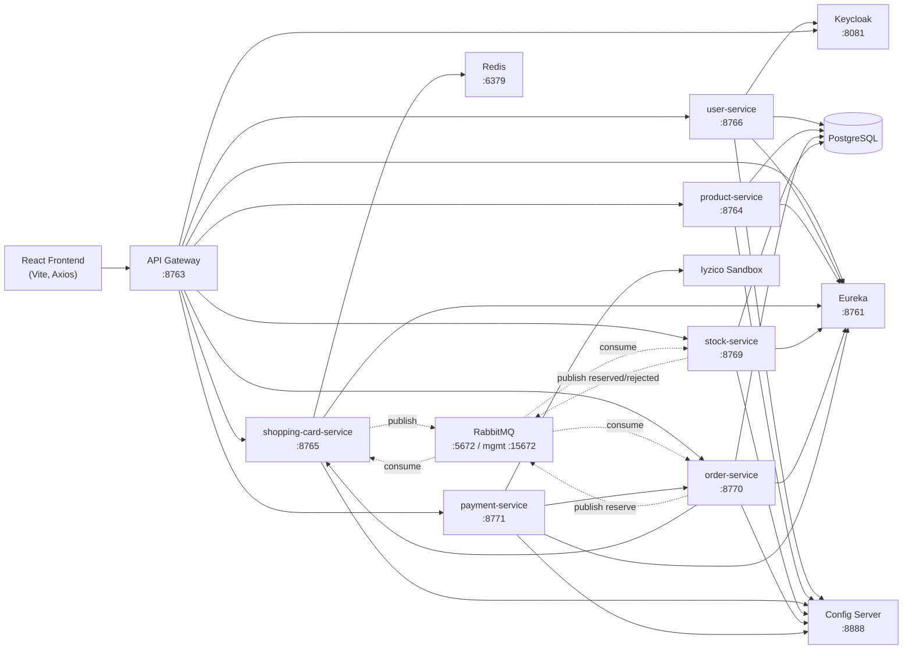
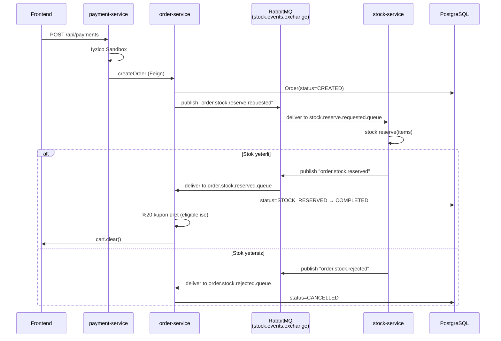

# KubaShop — Fullstack Mikroservis E-Ticaret Projesi

KubaShop, **Spring Boot mikroservis mimarisi** ve **React.js (Vite)** ile geliştirilmiş fullstack bir e-ticaret uygulamasıdır. Ürün kataloğu, sepet yönetimi, stok kontrolü, sipariş akışı, **Iyzico Sandbox** ödeme entegrasyonu, **Keycloak/JWT** tabanlı güvenlik, **RabbitMQ** üzerinden Saga pattern, **Redis** sepet cache'i, **Eureka** servis keşfi, **Spring Cloud Gateway** ve **Spring Cloud Config Server** içeren bir referans projedir.

Bu proje, **n11 TalentHub Bootcamp** bitirme projesi kapsamında hazırlanmış ve canlı sunucuya deploy edilmiştir.

---

## Canlı Erişim

Proje şu an gerçek bir VPS üzerinde çalışıyor. Aşağıdaki linklerden uçtan uca test edebilirsin:

| Servis | URL | Açıklama |
|---|---|---|
| Frontend (KubaShop) | http://92.249.61.16 | React + Vite arayüz, ürün kataloğu, sepet, ödeme formu |
| Swagger UI (Aggregated) | http://92.249.61.16:8763/swagger-ui/index.html | Tüm mikroservislerin OpenAPI dokümantasyonu, gateway üzerinden |
| Eureka Discovery | http://92.249.61.16:8761 | Servislerin canlı kayıt panosu |
| Keycloak | http://92.249.61.16:8081 | Kimlik ve yetkilendirme yönetimi (`microservice-realm`) |
| RabbitMQ Management | http://92.249.61.16:15674 | Exchange, queue, binding, mesaj akışı paneli |

---

## Proje Özeti

Kullanıcı, frontend üzerinden Keycloak hesabıyla giriş yapar (signup/signin akışı `user-service` ile köprülenmiştir). Ürün listesi `product-service`'ten gelir; bir ürünü sepete eklediğinde `shopping-card-service` Redis üzerinde kullanıcının sepetini günceller ve aynı zamanda **`shopping_cart_queue`'ya bir audit mesajı** publish eder (RabbitMQ kullanımının **canlı kanıtı**, iletilen mesajlar `CartAuditConsumer` tarafından tüketilip log'a yazılır).

Sepet onayında ödeme formu doldurulur, **`payment-service`** Iyzico Sandbox ile ödemeyi gerçekleştirir, başarılı ödeme sonrası **`order-service`**'e sipariş oluşturma isteği iletilir. `order-service` siparişi kaydeder ve **Saga pattern** ile RabbitMQ üzerinden `stock-service`'ten stok rezervasyonu ister. Stok rezerve edilirse sipariş `COMPLETED`, edilmezse `CANCELLED` olur. Başarılı siparişten sonra sepet otomatik temizlenir, kullanıcı sipariş tutarı **10.000 TL üzerindeyse ilk kez aldığı için %20 indirim kuponu** kazanır.

---

## Ekran Görüntüleri

> Aşağıdaki yer tutucu görselleri kendi `docs/screenshots/` klasörüne ekleyip linkleri güncelleyebilirsin.

| Sayfa | Açıklama |
|---|---|
| Ana sayfa kampanya banner'ı | İlk 10.000 TL+ alışveriş için %20 kupon vurgusu |
| Ürün listeleme | Çamaşır makinesi, bulaşık makinesi, monitör, robot süpürge — pagination ile |
| Ürün detay | Marka, kategori, renk, kargo bilgisi, sepete ekle |
| Sepet sayfası | Adet artırma/azaltma, kupon kodu kutusu, "Aktif Kuponlarım" bölümü |
| Ödeme formu | Ad, soyad, TCKN, adres, kart bilgileri, Iyzico/Visa/MasterCard/Troy |

---

## Mimari



---

## Servisler ve Sorumlulukları

Her servis tek başına çalışabilir, kendi veritabanı şemasıyla yaşar, gateway üzerinden dış dünyaya çıkar.

### `api-gateway` (port `8763`)
- **Stack:** Spring Cloud Gateway (WebFlux), Spring Security OAuth2 Resource Server (Keycloak JWT)
- **Sorumluluk:** Tek giriş kapısı, JWT doğrulama, route'lama, **CORS** yönetimi (tek noktadan), Swagger aggregation
- **Pattern:** API Gateway, Single Sign-On Token Validation, Centralized CORS

### `discovery-server` (port `8761`)
- **Stack:** Spring Cloud Netflix Eureka Server
- **Sorumluluk:** Tüm mikroservislerin canlı keşfi, `lb://SERVICE-NAME` çözümü
- **Pattern:** Service Discovery

### `config-server` (port `8888`)
- **Stack:** Spring Cloud Config Server
- **Sorumluluk:** Tüm servislerin `application.properties`'ini merkezden yönetmek
- **Pattern:** Externalized Configuration

### `user-service` (port `8766`)
- **Stack:** Spring Web, Spring Data JPA, PostgreSQL, **Keycloak Admin Client**
- **Sorumluluk:** Signup ve signin akışını yönetir, Keycloak'ta kullanıcı oluşturur, lokal DB'de profil tutar, JWT token döner
- **Pattern:** Adapter (Keycloak ↔ Application), DTO Layer, Repository

### `product-service` (port `8764`)
- **Stack:** Spring Web, Spring Data JPA, PostgreSQL, Pagination
- **Sorumluluk:** Ürün CRUD (read-only public), kategori, marka, fiyat
- **Pattern:** Repository, Specification, Pagination

### `shopping-card-service` (port `8765`)
- **Stack:** Spring Web, **Spring Data Redis**, RabbitMQ
- **Sorumluluk:** Kullanıcının sepetini Redis'te tutar (anahtar = username), sepet işlemleri (ekle/güncelle/sil/temizle), her ekleme **`shopping_cart_queue`'ya audit mesajı publish** eder
- **Pattern:** Cache-Aside (Redis), Event Publishing, Audit Log Consumer
- **Queue tüketimi:** `CartAuditConsumer` → `shopping_cart_queue` → loglama

### `stock-service` (port `8769`)
- **Stack:** Spring Web, Spring Data JPA, PostgreSQL, RabbitMQ
- **Sorumluluk:** Ürün stoklarını yönetir, Saga'da rezerve/commit/release işlemlerini yapar, gerekirse rejection event yayınlar
- **Pattern:** Saga (Choreography), Optimistic Locking, Event Listener
- **DLX/DLQ:** `stock.events.dlx` + `stock.reserve.requested.dlq` ile başarısız mesajlar deadletter'a düşer

### `order-service` (port `8770`)
- **Stack:** Spring Web, Spring Data JPA, PostgreSQL, RabbitMQ, **OpenFeign** (stock-service ve shopping-card-service'e sync çağrılar için)
- **Sorumluluk:** Sipariş oluşturma (Saga başlatıcısı), kupon üretimi, sipariş statü makinesi, sipariş geçmişi
- **Pattern:** Saga Orchestrator (mesaj tabanlı), State Machine (`CREATED → STOCK_RESERVED → COMPLETED` veya `CANCELLED`), Outbox-benzeri event publishing
- **Kupon kuralı (nice-to-have):** Toplam tutar > 10.000 TL ve kullanıcının önceden hiç kuponu yoksa, sipariş `COMPLETED`'e geçtiği anda `KUBA20-XXXXXX` formatında **tek kullanımlık %20 kupon** üretilir ve `coupons` tablosuna kaydedilir. Frontend'in sepet sayfasındaki "Kuponlarım" bölümü `/api/orders/coupons/user/{userId}` ile bunları çeker.

### `payment-service` (port `8771`)
- **Stack:** Spring Web, **Iyzico Java SDK**, OpenFeign (order-service'e), Spring Validation
- **Sorumluluk:** Ödeme isteğini Iyzico Sandbox'a iletir, başarılı ödeme sonrası order-service'e siparişi oluşturmaya tetikler, başarısız ödemede frontend'e detaylı hata gönderir
- **Pattern:** Anti-Corruption Layer (Iyzico ↔ KubaShop modeli), Idempotency Key, External Payment Gateway

---

## Saga Pattern (Sipariş ↔ Stok)

Sipariş ve stok arasındaki tutarlılık **mesaj tabanlı choreography** ile sağlanır:



**Routing tablosu:**

| Yön | Exchange | Routing Key | Queue | Tüketen |
|---|---|---|---|---|
| Order → Stock | `stock.events.exchange` | `order.stock.reserve.requested` | `stock.reserve.requested.queue` | stock-service |
| Stock → Order (success) | `stock.events.exchange` | `order.stock.reserved` | `order.stock.reserved.queue` | order-service |
| Stock → Order (fail) | `stock.events.exchange` | `order.stock.rejected` | `order.stock.rejected.queue` | order-service |
| Cart audit | (default) | `shopping_cart_queue` | `shopping_cart_queue` | shopping-card-service |

---

## Güvenlik Modeli

- **Keycloak realm:** `microservice-realm`
- **Public endpoint'ler (gateway'de `permitAll`):**
  `/api/user/signup`, `/api/user/signin`, `/api/products/**` (GET), `/api/stock/**` (GET), `/api/orders/coupons/**` (GET), `/api/shopping-cart/**`, Swagger
- **Korumalı endpoint'ler:**
  `/api/orders/**` (POST), `/api/payments/**` — JWT ister
- **JWT issuer & JWK:** `http://keycloak:8080/realms/microservice-realm/...` — gateway resource server olarak doğrular
- **Frontend Token:** `localStorage.kuba_token` üzerinden Axios interceptor ile her isteğe `Authorization: Bearer ...` ekler

---

## Kullanılan Teknolojiler

### Backend
- Java **21**, Spring Boot **3.5.x**
- Spring Web, Data JPA, Validation, Security, OAuth2 Resource Server
- Spring Cloud: Gateway (WebFlux), Config Server, Netflix Eureka, OpenFeign
- Spring AMQP / RabbitMQ
- Redis (Spring Data Redis, Lettuce)
- PostgreSQL 15
- Keycloak 25 (`microservice-realm`)
- Iyzico Java SDK (Sandbox)
- Springdoc OpenAPI 2.8.16
- JUnit 5, Mockito, Spring Boot Test
- Maven, Spring Boot Buildpack (Cloud Native Buildpacks via `spring-boot:build-image`)
- Docker, Docker Compose

### Frontend
- React **19**, Vite 8
- React Router, Axios (interceptor + skipAuth flag)
- React Hooks: `useState`, `useEffect`
- SweetAlert2 (modal & toast)
- Jest + React Testing Library
- Özel CSS tema (lacivert + sarı vurgu, "lüks alışveriş" hissi)

### DevOps
- **Docker Compose** ile tek komutla 12 container ayağa kalkar (postgres, rabbit, redis, keycloak, eureka, config, gateway + 6 servis)
- **Spring Boot Buildpack / Jib** ile **Dockerfile yazmadan** image üretimi
- Spring Cloud Config ile environment-based configuration
- VPS (Ubuntu 22.04) üzerinde production deployment
- RabbitMQ Management UI ile canlı saga izleme

---

## Bootcamp Gereksinim Karşılama Tablosu

### Backend gereksinimleri

| Gereksinim | Karşılayan |
|---|---|
| RESTful web servisi | Tüm mikroservisler (RestController + DTO) |
| PostgreSQL | user, product, order, stock servislerinde ayrı şemalar |
| Pagination | `product-service` `Pageable` ile |
| Sepet işlemleri | `shopping-card-service` Redis backend |
| Sipariş yönetimi | `order-service` + Saga state machine |
| Ödeme entegrasyonu | `payment-service` Iyzico Sandbox |
| JWT Auth | Keycloak + Gateway resource server |
| Unit + Integration test | `*ServiceTest`, `*ControllerTest`, `*RepositoryTest`, `*IntegrationTest` |
| Swagger | Springdoc + Gateway aggregation (`/swagger-ui.html`) |
| Loglama | SLF4J + Logback (her servis), audit consumer log'u |

### Frontend gereksinimleri

| Gereksinim | Karşılayan |
|---|---|
| Ürün listeleme & detay | `ProductList`, `ProductDetail` componentleri |
| Hooks ile state | `useState`, `useEffect`, `useNavigate` |
| Pagination UI | Ürün listesi sayfalama |
| Sepet UI | `CartPage` + `CartItem` |
| API entegrasyonu | `services/apiClient.js` Axios + interceptor |
| Hata yönetimi | SweetAlert2 toast'ları + try/catch + loading state |

### DevOps gereksinimleri

| Gereksinim | Karşılayan |
|---|---|
| Docker | `docker-compose.yml` ile tüm servisler container'da |
| Jib / Buildpack | `mvn spring-boot:build-image` Dockerfile'sız image |
| CI/CD | GitHub Actions pipeline iskeleti, build-test-image-deploy mantığı |
| Jenkins karşılaştırması | README'de pipeline mantığı + alternatif yaklaşım |
| Cloud deployment | VPS (Ubuntu) üzerinde production deploy; AWS Elastic Beanstalk + RDS yaklaşımı dokümante |
| Monitoring | RabbitMQ Management UI; Slack webhook hook'u entegre edilebilir |

### Nice-to-have: Kupon Sistemi

Bootcamp gereksinimlerinin üzerine eklenen özelliktir. Mantık:

1. Kullanıcı ilk kez **toplam ≥ 10.000 TL** olan bir siparişi tamamladığında
2. Order-service `COMPLETED` statüsüne geçişte tetiklenir
3. Tek kullanımlık `KUBA20-XXXXXX` formatında **%20 indirim kodu** üretilir
4. `coupons` tablosuna `userId`, `code`, `used=false` ile yazılır
5. Frontend `CartPage`'in "Aktif Kuponlarım" bölümü `/api/orders/coupons/user/{userId}` ile listeyi getirir
6. Kupon kullanıldığında `used=true` set edilir ve indirim ara toplama uygulanır

Bu özellik için iki ayrı GET endpoint sağlanmıştır (`/coupons/user/{userId}` ve `/coupons/username/{username}`) — token yenilenip `userId` belirsiz kaldığında bile kuponlar kaybolmasın diye.

---

## Frontend Geliştirme Notu

Frontend tarafının ilk iskeleti, component yapısı, CSS tasarımı ve SweetAlert2 entegrasyonları **OpenAI Codex** desteğiyle hazırlanmıştır. Backend ile entegrasyon kısımları (Axios interceptor mantığı, `kuba_token` yönetimi, ödeme formundan payment-service'e giden istek yapısı, kupon listesi çağrıları) tarafımdan elle kontrol edilmiş ve test edilerek production'a hazır hale getirilmiştir.

---

## Yapay Zeka Yardımı Aldığım Noktalar

Şeffaflık adına projede aldığım AI desteklerini açıkça belirtiyorum:

| Konu | AI Aracı | Katkı |
|---|---|---|
| Frontend component iskeletleri ve CSS | OpenAI Codex | Component üretimi, stil önerileri |
| Payment-service Iyzico SDK entegrasyonu | OpenAI Codex + Anthropic Claude | SDK çağrı yapısı, hata yönetimi, idempotency |
| RabbitMQ saga, exchange, queue, binding düzenlemeleri | Anthropic Claude | Routing key tutarlılığı, JSON converter, audit consumer ekleme |
| CORS / Network Error debug ve canlı deploy | Anthropic Claude | API Gateway CORS tek noktadan yönetimi, OrderController @CrossOrigin temizliği, frontend `.env` VPS yönlendirmesi |
| Logback `/workspace/logs` restart loop hatası | Anthropic Claude | `${LOG_DIR:-/tmp}` çözümü |
| Docker + Jib (Dockerfile'sız image) yaklaşımı | OpenAI Codex | Buildpack komutları, image tagging |

Her AI önerisi tarafımdan **gözden geçirilmiş, test edilmiş ve gerekli değişiklikler yapılmıştır** — yani yapay zeka asistan olarak kullanılmış, "kopyala-yapıştır" yapılmamıştır.

---

## Lokal Çalıştırma

```bash
# 1. Repo'yu klonla
git clone https://github.com/<your-username>/n11-talenthub-bootcamp-final-project.git
cd n11-talenthub-bootcamp-final-project

# 2. Backend image'larını üret (Maven + Buildpack)
cd n11-talenthub-project-be
for svc in discovery-server config-server api-gateway user-service product-service shopping-card-service stock-service order-service payment-service; do
  cd $svc
  mvn clean package -DskipTests
  mvn spring-boot:build-image -DskipTests -Dspring-boot.build-image.imageName=$svc:latest
  cd ..
done
cd ..

# 3. Tüm stack'i ayağa kaldır
docker compose up -d
docker compose ps

# 4. Frontend
cd ecommerce-frontend
npm install
npm run dev    # http://localhost:5173
```

VPS deploy için `.env` dosyasında `VITE_API_BASE_URL`'i VPS IP:port'a yönlendirip `npm run build` yap, çıktıyı nginx ile servis et.

---

## Referans Proje

Bootcamp kapsamında inceleme/karşılaştırma için bakılan referans proje:
[selimsahindev/n11-talenthub-bootcamp-final-case](https://github.com/selimsahindev/n11-talenthub-bootcamp-final-case)

---

## Lisans ve İletişim

n11 TalentHub Bootcamp bitirme projesi olarak hazırlanmıştır, eğitim amaçlıdır.

**Geliştirici:** Kübra Karadirek
**E-posta:** karadirekkubra96@gmail.com
**Tarih:** Mayıs 2026
